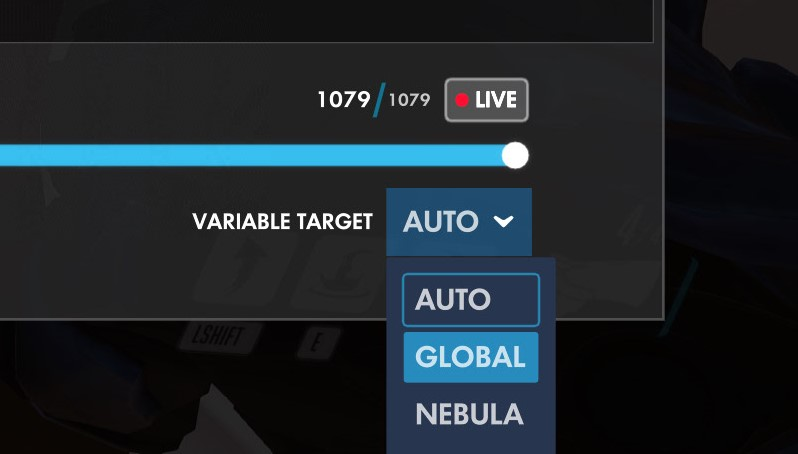

# Nebula's Force Orb Order Mod for Hax Framework

This mod requires Hax's Doomfist Parkour play template (CODE: KNEAT).

This mod adds the ability to create hints for CPs of your choosing. 
If a player fails a checkpoint that has been marked as a Hint CP, a small message (of your making) will appear briefly. The message will only display for the first 7 times that a player fails a particular CP. The player can also view the hint manually, any number of times, by pressing Melee.  Hints will only appear if Pro Mode is off.

In addition, this mod adds the ability to force the order of picking up ability orbs. This is not to be used with any other orbs than **ability** orbs. Death orbs will **NOT** work. I have not tested any other orb but I assume they will all be broken on any checkpoint that uses this mod!  


## **WARNING:** 
This is a modification to the KNEAT template made by Hax. BEFORE PASTING ANY CODE, MAKE SURE YOU ARE NOT OVERWRITING ANY EXISTING VARIABLES or SUBROUTINES. 

Variables and subroutines in the workshop are numbered, check that the NEW variables and subroutines defined in this mod are free in your live map (ie. make sure its number is a free slot in the variable list (non-free variables are greyed out); if not, change its number to a number with a free slot).


## REFERENCE FOR NEW VARIABLES/SUBROUTINES:
```
variables
{
	global:
		123: tempIterator
		124: menuItems
		125: menuTextCollector
		126: orbHintArray
		127: hintStringsArray

	player:
		117: LevelLengths
		118: LevelCheckpoints
		119: dataCorrector
		120: orbHintArrayCopy
		121: hintStringsArrayCopy
		122: deletedLevel
		123: currentHintCP
		124: autoHintCounter
		125: confirmDelete
		126: menuIsOpen
		127: currentMenuSelection
}

subroutines
{
	126: DisableControls
	127: EnableControls
}
```

# INSTALLATION

## STEP ONE: MAP CREATION

**ATTENTION: Save your map data!!! Preferably in a .txt file!!!**  

IN THE HAVVX TEMPLATE:  
1. Copy and paste the code from the [HAVVX_Orb_Numbers](HAVVX_Orb_Numbers.ow) file and reload.  
This allows you to see clearly the order of the orbs while creating a checkpoint.  
I suggest placing all orbs you will need *BEFORE* fine-tuning their size/position because the numbering changes during orb creation.  
Otherwise, you may have to reposition the orbs!  

**ATTENTION: Save your map data!!! Preferably in a .txt file!!!**  

## STEP TWO: INSTALLATION / SYNCHRONIZATION / MARKING CHECKPOINTS
IN THE KNEAT TEMPLATE:
1. Copy and paste the contents of [Hint_ForceOrbOrder_Mod](Hint_ForceOrbOrder_Mod.ow) into your live map and reload.  

2. Press any *Spray* to open (and close) the menu.  
3. Click *Synchronize* to install; this will initialize the marking arrays. You can click this button at any time to ensure data is synced!    
4. Navigate to the checkpoints that require this mod, open the menu, and click the corresponding button to mark the checkpoint as *Hint*, *2 Orb*, or *3 Orb*.  
A small message will appear on screen showing that the checkpoint has been set to *True*.   
You are unable to set a single checkpoint to both 3 Orb and 2 Orb. It will default to the last selection.  

## STEP THREE: SAVING DATA
1. Press *Esc* and then click the *Open Workshop Inspector* button.  
2. Select *Global* from the drop down menu in the bottom right corner of the Inspector.  

3. Click the "(x)" button directly to the left of the drop-down menu which will copy to clipboard all global variables as workshop actions.  

4. Paste what you copied from the Inspector into the *actions* section of the *Paste Orb / Hint Data Here* rule which is located at the bottom of the rule list.    
The only actions you will need in this list are the last two. They define the variables *Global.orbHintArray* and *Global.hintStringsArray*.
  
Don't worry if your arrays will not look the same as this; they will be much longer.  
5. Use the *Select All* button in the *actions* section and uncheck the two arrays *Global.orbHintArray* and *Global.hintStringsArray*. 
6. Use the *Delete* button in the *actions* section to delete all unnecessary data.


## STEP FOUR: DISABLING RULES
1. Disable the Hax Framework rule named *TCD detect*. If this is not done, this mod may not work properly!  

2. Disable the rules that are located between the two that look like:
▒▒▒▒▒▒▒▒▒▒▒▒▒▒▒▒▒▒▒▒▒▒▒▒▒▒▒▒▒▒▒▒▒▒▒▒   


## STEP FIVE: ENTERING HINT MESSAGES
The variable, *Global.hintStringsArray*, contains the text that will appear as a hint.
1. In the text editor, replace the dummy text with your Hint Messages where appropriate. 
	- *NOTE*: Keep your Hint Message brief! It should not exceed one line.  

	- *NOTE*: any text in a Custom String MUST be placed bewteen quotations: eg. Custom String("[your text here]") will display: [your text here]
2. *(Optional)* Save the .txt file as Hint Data.txt for safety 
3. Now, Select All, copy, and paste these updated actions into the "Paste Orb / Hint Data Here" Rule and delete the old *Global.hintStringsArray*.
